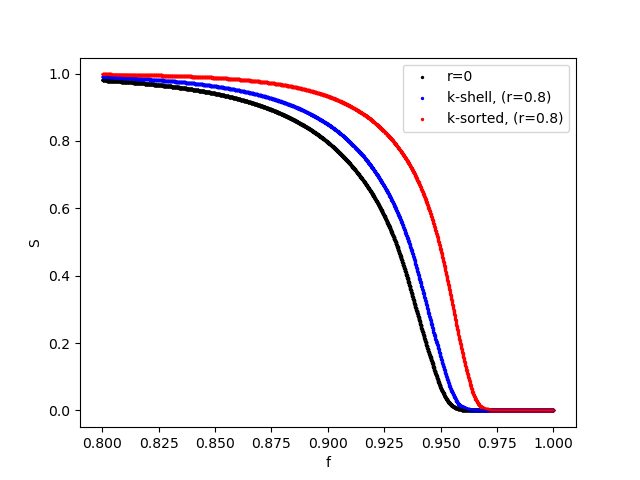

# Tumor Biochemical Heterogeneity and Cancer Radiochemotherapy: Network Breakdown Zone-Model

In this project we investigate the effect of tumor hypoxia in the resilience of a tumor network under radiochemotherapy. Two models were created, which performed targeted attack in the nodes of an Erdős–Rényi random network, utilizing the concept that the nodes close to the center of the tumor will be less probable to be removed due to hypoxia. 

The first model (k - shell), utilizes the idea that the nodes of the network with higher k-shells are close to the center of the network. Thus, after calculating the k-shells of each network, we divide the nodes of the network to two zones. We assume that the nodes of the last k-shell (the nucleous) will belong to 1st zone while the rest of the nodes to the other zone. Then we assign different removal probabilities. The nodes of the external zone will always have removal probability equal to 1, while the nodes of the internal zone will be a parameter of the model.

The logic basis of the second model (k - sorted) is similar. The difference is that we sort the nodes based on their degree connectivity and then assign half of the highest degree nodes to the internal zone and the rest to the external.  

In the code we present the probability assignment, the removal process and the calculation of critical values for each model, such as the distribution of clusters and the relative size of the largest cluster. If you use this code or find the models relevant to your research, please cite our work https://www.mdpi.com/1099-4300/24/8/1069 where we compare and analyze the models in detail.

<figure>
  
  <figcaption>Figure 1:  Relative size of the largest cluster S during the entire removal process for the two models as a function of the removed nodes, f. for 
 networks with average k equal to 20 and N = 10000. The results are produced for two values of the reduction rate between the two zones (0 and 0.8). For r=0 the two models are the same. </figcaption>
</figure>
